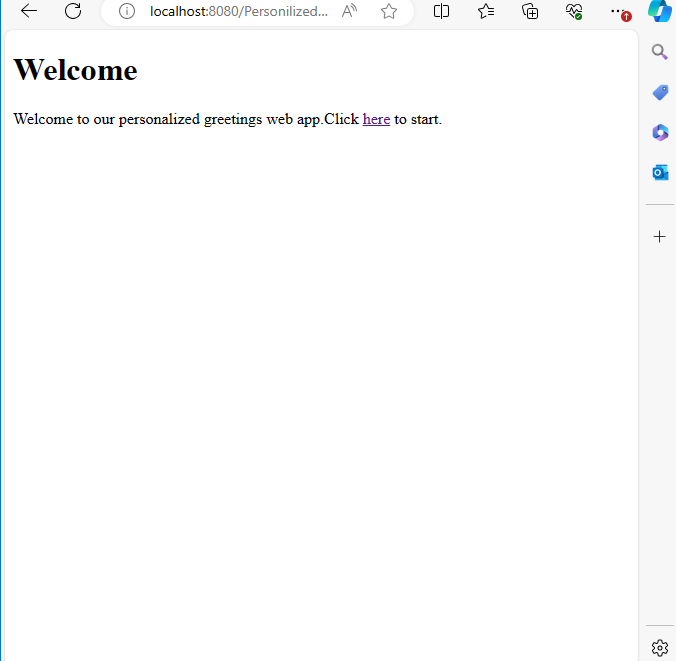
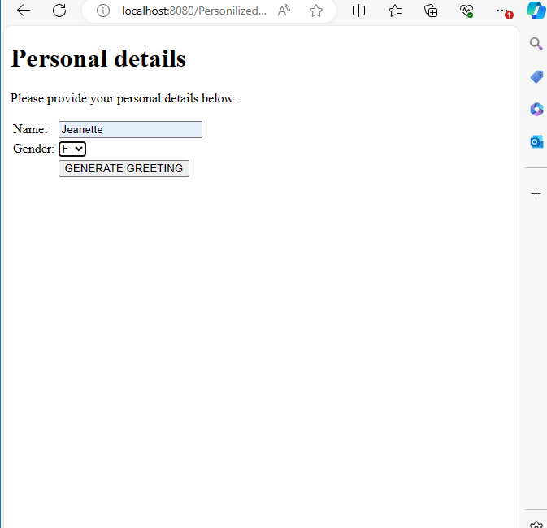
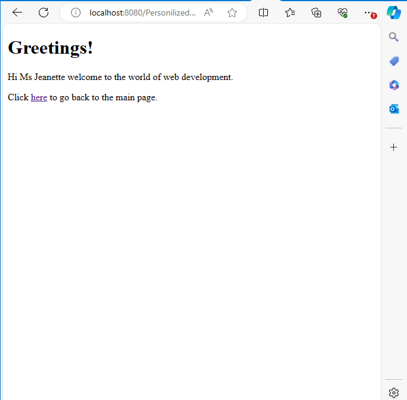

# PersonalizedWebApplication

## Overview
PersonalizedWebApplication is a basic web application that generates a personalized greeting message based on the user's gender. The application follows the Model-View-Controller (MVC) architecture and utilizes HTML, Servlet, and JSP.

## How It Works

### Model
The model is represented by the Greet class, which contains the business logic for generating a greeting based on the user's gender.

### View
The views are the HTML and JSP pages:

index.html: The home page.

start.html: The input form where users enter their name and select their gender.

output.jsp: Displays the personalized greeting message.

### Controller
The controller is the PersonalizedGreetingServlet which handles user input and directs it to the appropriate view.

# Example of Code Snippets Output

*Figure 1: Screenshot of the Home Page*

*Figure 2: Screenshot of the Input Page*

*Figure 3: Screenshot of the Input Form*

